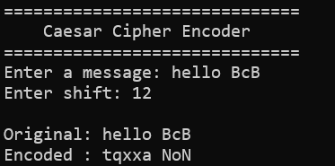

# week 4

## Challenge 1. 함수 작성 밑 호출 구조 이해

### 시저 암호란?
시저 암호는 알파벳을 일정한 칸 수만큼 이동시켜 문자열을 암호화하는 방식이다. 예를 들어 shift가 3이면 A는 D로, Z는 C로 바뀐다. 복호화할 때는 반대 방향으로 같은 칸 수만큼 이동한다.

### 실습 코드
```bash
#include <stdio.h>
#include <stdlib.h>
#include <string.h>

void print_banner(void);
int get_shift(void);
void encode(char *str, int shift);
void decode(char *str, int shift);


void print_banner(void)
{
    printf("==============================\n");
    printf("    Caesar Cipher Encoder\n");
    printf("==============================\n");
}

int get_shift(void)
{
    int shift;

    printf("Enter shift: ");

    if (scanf("%d", &shift) != 1) {
        printf("Invalid input. Enter an integer.\n");
        exit(EXIT_FAILURE);
    }

    shift = shift % 26;

    if (shift < 0) {
        shift += 26;
    }

    return shift;
}


void encode(char *str, int shift)
{
    int i;

    shift = shift % 26;

    if (shift < 0) {
        shift += 26;
    }

    for (i = 0; str[i] != '\0'; i++) {
        if (str[i] >= 'A' && str[i] <= 'Z') {
            str[i] = 'A' + (str[i] - 'A' + shift) % 26;
        }
        else if (str[i] >= 'a' && str[i] <= 'z') {
            str[i] = 'a' + (str[i] - 'a' + shift) % 26;
        }
    }
}

int main(void)
{
    char str[200];
    int shift;

    print_banner();

    printf("Enter a message: ");

    if (fgets(str, sizeof(str), stdin) == NULL) {
        printf("Failed to read the message.\n");
        return 1;
    }

    str[strcspn(str, "\n")] = '\0';

    shift = get_shift();

    printf("\nOriginal: %s\n", str);

    //암호화
    encode(str, shift);
    printf("Encoded : %s\n", str);

    return 0;
}
```

### 실행 결과


### 함수를 사용하는 이유
함수는 코드를 기능별로 나누어 실행 흐름을 이해하기 쉽게 만들고, 같은 기능을 재사용하여 중복 코드를 줄여준다. 문제가 발생했을 때 해당 함수만 확인하거나 수정할 수 있어 유지보수에도 유리하다.

### 어떤 상황에서 유리한가?
같은 작업을 여러 번 수행하거나, 프로그램이 길어져 기능별로 나눠야 할 때 유용하다. 

## Challenge 2. gdb로 스택 프레임 관찰

### 스택 프레임이란?


